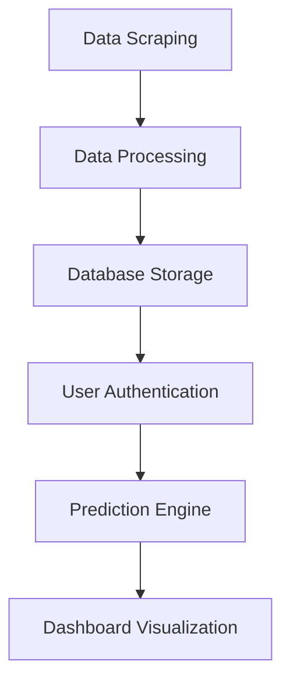

# 🚔 Crime Intelligence & Analytics Dashboard


An end-to-end full-stack application that analyzes historical crime patterns, predicts future risks, and delivers interactive visual insights.

---

## 🌐 Live Preview (Optional)

> Add your deployed link here

```bash
https://github.com/bhanusrikarsai/crimerate-prediction-analysis
```

---

## 📌 Project Overview

This system combines **Data Science + Web Development** to transform raw crime data into meaningful insights.

### 🔹 Modules

| Module                 | Description                                            |
| ---------------------- | ------------------------------------------------------ |
| 🧠 Prediction System   | Backend service for authentication & crime forecasting |
| 📊 Analytics Dashboard | Frontend UI for visualization and reporting            |

---

## ✨ Core Features

* 🔐 **Secure Authentication**

  * OTP-based login system using email verification

* 🤖 **Automated Data Collection**

  * Scrapes real-world data using headless browsing

* 📈 **Predictive Modeling**

  * Forecasts crime trends & high-risk zones

* 🗺️ **Interactive Dashboard**

  * Maps, charts, and dynamic analytics

---

## 🛠️ Tech Stack

<details>
<summary>Click to expand</summary>

| Category      | Technologies                   |
| :------------ | :----------------------------- |
| 🎨 Frontend   | React, HTML5, CSS3, JavaScript |
| ⚙️ Backend    | Node.js, Express.js            |
| 🗄️ Database  | MongoDB                        |
| 🔒 Security   | bcryptjs, Nodemailer (OTP)     |
| 🤖 Automation | Puppeteer                      |

</details>

---

## ⚙️ Installation & Setup

### 🔧 1. Environment Configuration

Create `.env` file inside `prediction-system`:

```env
EMAIL_USER=your-service-email@gmail.com
EMAIL_PASS=your-app-password
```

⚠️ **Important:** Never push `.env` to GitHub

---

### 📦 2. Install Dependencies

```bash
# Backend
cd crime-rate-prediction-system
npm install

# Frontend
cd crime-dashboard
npm install
```

---

### ▶️ 3. Run the Project

```bash
npm start
```

💡 Run backend and frontend in separate terminals

---

## 🔄 Workflow



---

## 📊 System Flow

<details>
<summary>Click to view step-by-step flow</summary>

1. 📥 Data is collected using automation
2. 🧹 Cleaned and structured
3. 🗄️ Stored in MongoDB
4. 🔐 User logs in via OTP
5. 📈 Predictions are generated
6. 📊 Dashboard displays insights

</details>

---

## 📸 Screenshots (Optional)

> Add images like this:

```md

```

---

## 🚀 Future Improvements

* 🔍 Real-time crime data integration
* 🧠 Advanced ML models
* 📱 Mobile responsiveness
* 🌍 Geo-based alerts

---

## 📄 License

Licensed under the **ISC License**

---

## 🤝 Contributing

Pull requests are welcome!
For major changes, open an issue first.

---

## ⭐ Support

If you like this project:

👉 Give it a ⭐ on GitHub
👉 Share with others

--
